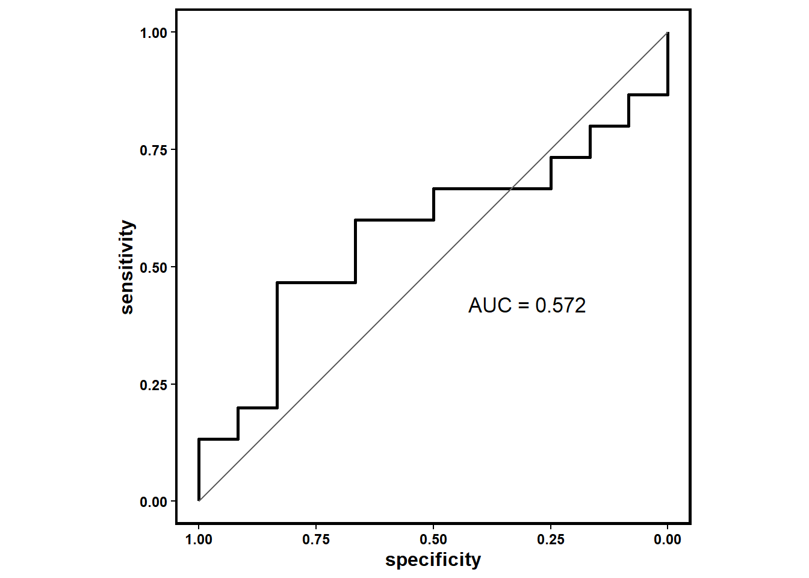

# 🤖 Prediction Model Construction

## Build Model
 You can use function **build_Model** to build machine learning predictive model including naive Bayes models, Support vector machine model, random forest model, Cancerclass model, Adaboost model, Logitboost model, Logistics regression model.
 The function returns a trained model.


```r
train_set <- list(MEL_GSE91061, MEL_phs000452, RCC_Braun_2020)
mymodel <- build_Model(Model='NB', SE=train_set, feature_genes=Stem.Sig, response_NR = TRUE)
```

## Test Model
 **test_Model** are designed for testing model built by **build_Model** function. This function returns a ROC object.


```r
test_Model(mymodel,MEL_GSE78220)
```

```
## Setting levels: control = N, case = R
```

```
## Setting direction: controls > cases
```

```
## [[1]]
## 
## Call:
## roc.default(response = data[[2]]$response_NR, predictor = value[,     1]/value[, 2])
## 
## Data: value[, 1]/value[, 2] in 12 controls (data[[2]]$response_NR N) > 15 cases (data[[2]]$response_NR R).
## Area under the curve: 0.5722
## 
## [[2]]
```



```
## 
## [[3]]
##  [1] "R" "R" "R" "R" "R" "R" "R" "R" "R" "R" "R" "R" "R" "R" "R" "R" "R" "R" "R"
## [20] "R" "R" "R" "R" "R" "R" "R" "R"
```

