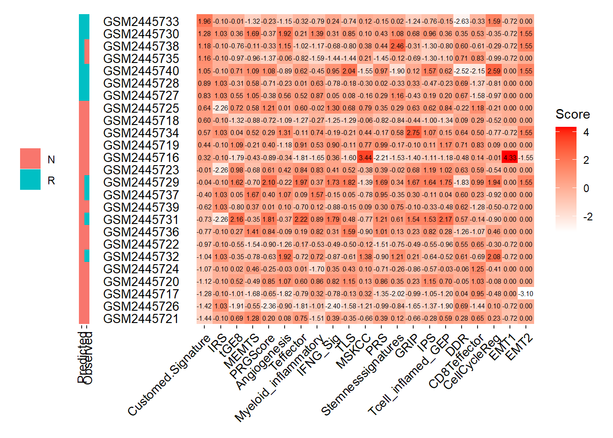

# 🔮 Response Prediction
**pred_response** function predicts the immunotherapy response for the patients from gene expression data using our pre-trained machine learning models or public gene expression signatures.


```r
pred_response(SE=MEL_GSE93157,Signature = ipt,
              method = "Weighted_mean",threshold = 0.8,
              PT_drop = FALSE,sort_by = "Customed.Signature",
              group_by = "Customed.Signature",show.Observed = TRUE,
              rankscore = FALSE)
```

```
## 2 Signature genes are not found in expression matrix. The function can execute properly, but the performance of the model may be compromised.
## 2 Signature genes are not found in expression matrix. The function can execute properly, but the performance of the model may be compromised.
```

```
## 1 Signature genes are not found in expression matrix. The function can execute properly, but the performance of the model may be compromised.
```

```
## 3 Signature genes are not found in expression matrix. The function can execute properly, but the performance of the model may be compromised.
```

```
## 1 Signature genes are not found in expression matrix. The function can execute properly, but the performance of the model may be compromised.
```

```
##  B.cell T.cell.CD4. T.cell.CD8. Neutrophil Macrophage Myeloid.dentritic.cell IRS tGE8 MEMTS PRGScore Angiogenesis Teffector Myeloid_inflammatory IFNG_Sig TLS MSKCC LMRGPI PRS Stemnesssignatures Riskscore IPS Tcell_inflamed_GEP DDR CD8Teffector CellCycleReg PanFTBRs EMT1 EMT2 EMT3 does not exist in expression matrix.
```


